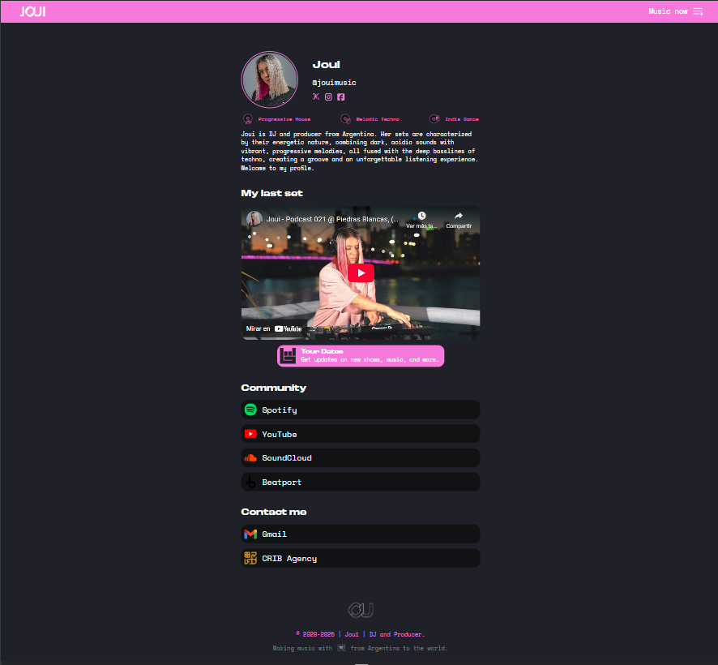
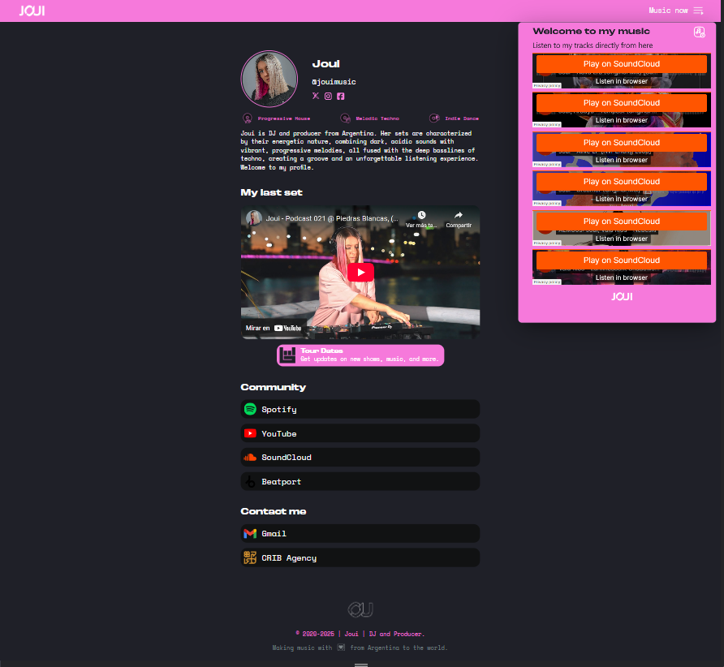
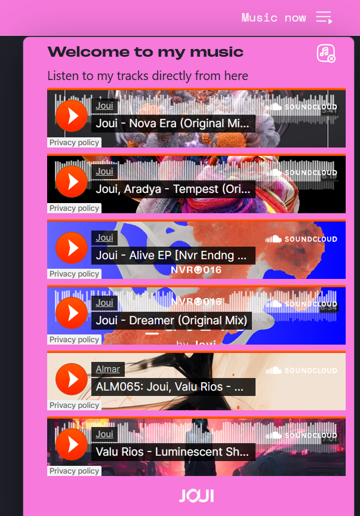
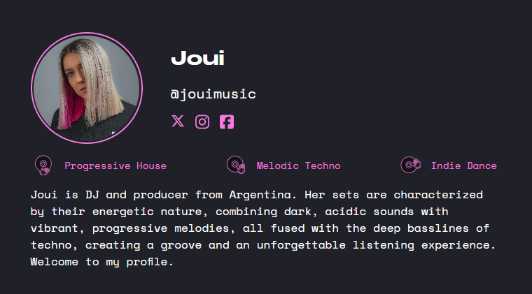

# Link Bio - JOUI DJ 🎧

Proyecto web creado con [Reflex](https://reflex.dev) para mostrar los enlaces y redes sociales de JOUI DJ.

## 🌐 Capturas de pantalla

### Página principal



### Página principal + Popover



### Popover



### Navbar


### Profile



### Video


### Links


## ⚙️ Tecnologías utilizadas

- 🐍 Python 3.11+
- ⚡ Reflex (anteriormente Pynecone)
- 🖼️ HTML/CSS (generado desde Python con Reflex)
- 🎨 Responsive Design

## 🚀 Instalación y ejecución

```bash
# Clonar el repositorio
git clone https://github.com/AguSine/link-bio-JOUI-DJ.git
cd link-bio-JOUI-DJ

# Instalar dependencias
pip install -r requirements.txt

# Ejecutar la app
reflex run